# Counters-8-bit
## Lab 1 - Counter Programs

### Introduction
In this lab four different counters are created in order to be implemented on a FPGA board (Zybo Z7-20). The four counters
created were ring counter, binary counter, fibonacci counter, and the johnson counter using the LED's and switches on the board.
A clock divider is also created in order to be able to see the output of the LED's on the board to the human eye. The frequency of the FPGA is 125 MHz which is slowed down to 1 Hz.

### Procedure
1. The clock divider is created first in order to be able to slow down the frequency of the FPGA board from 125 MHz to 1 Hz with a 50% duty cycle. A counter is used in order to be able to slow down the frequency. When the counter reaches half the cycle (62499999) the clock is toggled and count is reset. A testbench is created in order to make sure the clock divider is working correctly (clock_divider_tb.vhd)
2. All counters are created inside a case statement in order to enable a certain counter when a certain switch is toggled. The defined states are: "0000", "0001", "0010", "0100", and any other state defaults to all LED's being turned on.
3. Constraints file is created in order to map the LED's, switches, and clock of the FPGA board to the program.

### Results
#### Clock Divider Results:
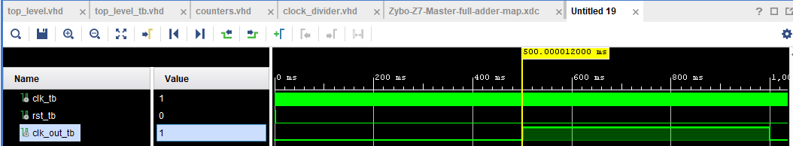  
#### Ring Counter Results:  
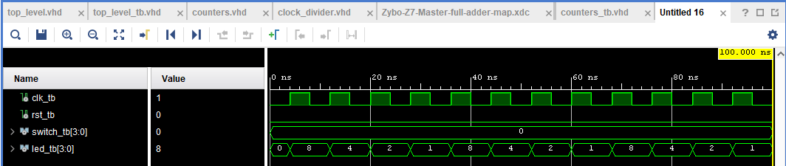  
#### Binary Counter Results:
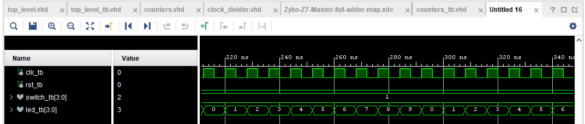  
#### Fibonacci Counter Results:
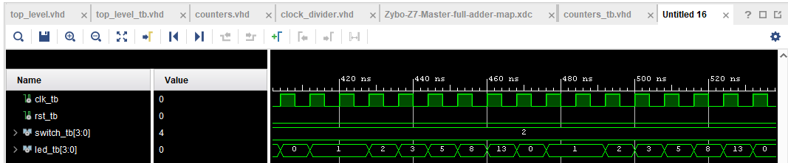  
#### Johnson Counter Results:
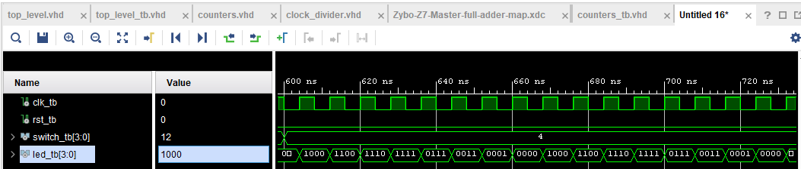  
#### Top Level Results:
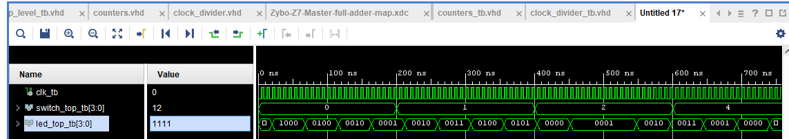  

### FPGA Resources:
#### Top Level RTL Schematic:
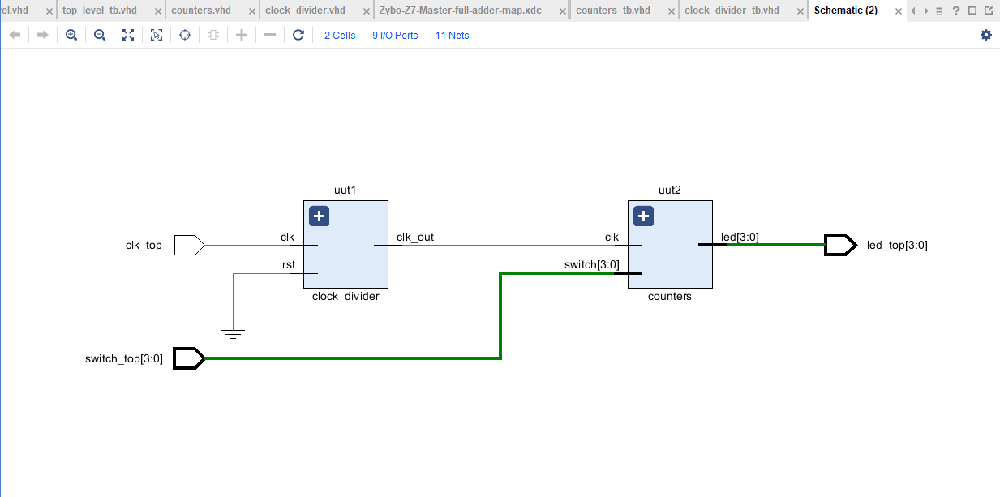  
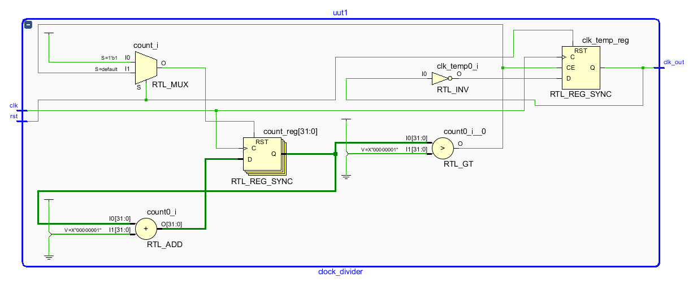  
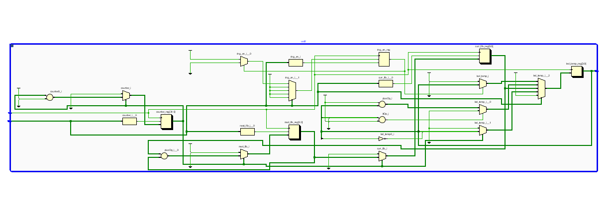  
#### Synthesis Schematic:
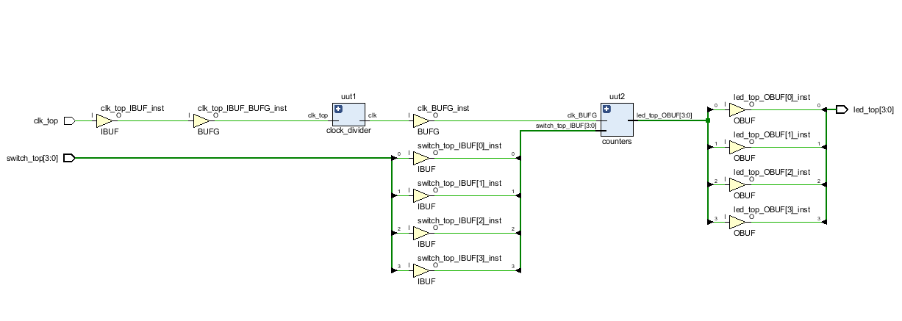  
#### Utilzation Report:
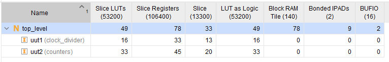  
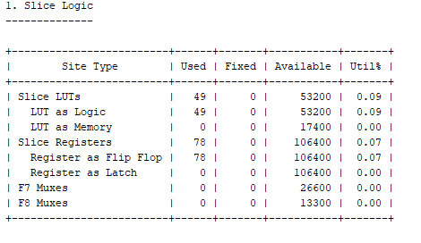  
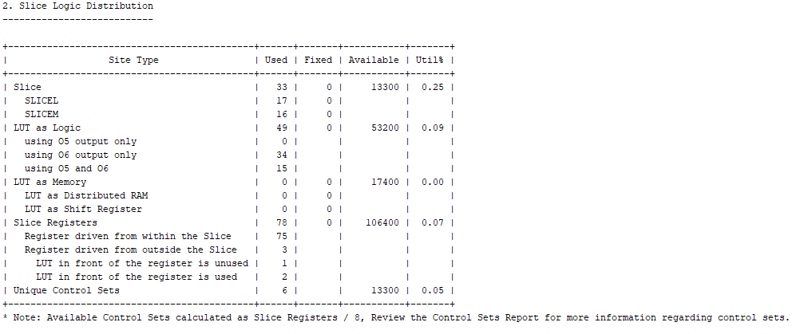  
